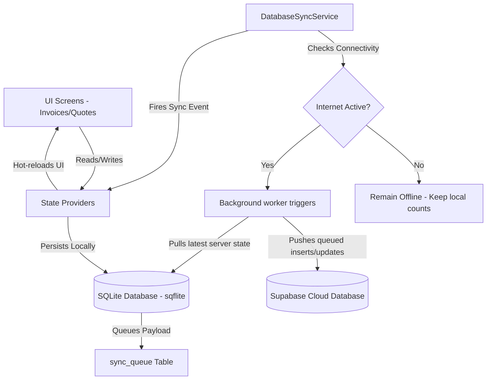

# Quickfix - Enterprise Field Service & Offline-First Management System

Quickfix is a premium, state-of-the-art field service management platform built with Flutter. It is designed to empower field technicians and office administrators to manage customers, inventory, inspections, quotes, and invoices seamlessly, even in remote environments with zero network connectivity.

---

## 🛠 Key Capabilities & System Modules

### 1. 💼 Admin Dashboard & Management Hub
- **Sales & Conversion Analytics**: Interactive metrics representing conversion rates, sales trends, unpaid/overdue invoice totals, and technician statistics.
- **Customer Hub**: Complete CRM registry tracking contact details, customer sites, specialized service notes, and evolutionary coordinates.
- **Product Inventory Manager**: Centralized catalog specifying barcodes, SKU codes, categories, descriptions, and dynamic safety stock thresholds (minimum/maximum alerts).
- **Quote Creation & Approvals**: Advanced quoting engine with customizable line items, tax rates, discount structures, and direct converting tool to generate invoices from approved quotes.
- **Invoice & Debt Recovery**: Visual table listing customer billing histories. Supports recording full/partial payments, displaying visual payment breakdowns, and alerting administrators to overdue invoices.
- **Profile & Sync Settings**: Control configuration parameters, offline databases, and force manual pull/push synchronizations.

### 2. 🔧 Technician Field Operations
- **Technician Dashboard**: Compact field portal summarizing daily inspections, draft quotes, and key technician progress KPIs.
- **Site Measurements**: Logging of site physical dimensions, construction materials, coordinates, and photo attachments.
- **On-Site Quoting**: Draft and print cost estimates directly on-site in front of customers using catalog pricing.

---

## 🏗 System Architecture & How it Functions



### 1. Offline-First Synchronization Architecture
All data manipulations (Insertions, Updates, Deletes) are executed against the local **SQLite Database** first. UI operations complete instantly, avoiding loading spinners or network timeouts.

### 2. Synchronization Queue Mechanics
- When a local write succeeds, an entry is added to a database table called `sync_queue` containing:
  - Table target (e.g. `invoices`)
  - Operational keyword (`insert` or `update`)
  - Unique UUID of the record
  - JSON payload of the changes
- A background worker polls this queue every **30 seconds** (when online) and pushes the payloads sequentially to **Supabase** via REST endpoints.
- If a sync step fails (e.g., brief signal drop), the retry counter increments, and execution resumes during the next sweep, avoiding duplicate data corruption.

### 3. Dynamic Visual Sync Status Indicator
Every main screen displays a badged **SyncRefreshButton** in the AppBar:
- **Spinning state**: Active background worker syncing data.
- **Badge integer**: Total offline modifications currently queued, giving immediate visual feedback of unsaved local data.

---

## 🚀 Setup & Installation Guide

### Prerequisites
- **Flutter SDK** (v3.0.0 or higher)
- **Dart SDK** (v3.0.0 or higher)
- **Supabase Account** with an initialized schema matching SQLite tables

### Environment Configurations
Create a `.env` file at the root of the workspace:
```env
SUPABASE_URL=https://your-project-id.supabase.co
SUPABASE_ANON_KEY=your-anon-public-key
```

### Running Locally
Run the following commands in the workspace root directory:
```bash
# Install dependencies
flutter pub get

# Launch on a specific device (e.g., Windows Desktop)
flutter run -d windows
```

---

## 📖 Complete System User Manual

### 🔐 Part 1: Authentication & Logging In
1. Launch the Quickfix application.
2. Select your role option or enter your credentials on the login screen.
3. Once authenticated:
   - **Administrators** are redirected to the Admin Dashboard.
   - **Field Technicians** are redirected to the Technician Dashboard.

---

### 💼 Part 2: Administrative User Workflows

#### 1. Adding Customers & Products
- **Add Customers**: Navigate to **Customers** from the sidebar menu. Click **Add Customer** in the top right. Complete the form (Name, Email, Phone, Address, Site Notes) and click **Save**.
- **Add Products**: Navigate to **Inventory/Products** from the sidebar. Click **Add Product**, enter the details (SKU, Price, Stock thresholds, Barcode), and save.

#### 2. Creating Quotes
1. Click **Quotes** in the sidebar, and select **Create Quote**.
2. Select a customer from the dropdown list.
3. Click **Add Item** to choose items from the product catalog, adjust quantities, or add a customized discount percentage.
4. Fill in the **Scope of Work** and **Terms** text blocks.
5. Click **Create Quote**. The estimate will appear in the Quotes list immediately as *Draft*.
6. Click on a quote to view details, then mark it as **Approved** or **Rejected**.

#### 3. Invoice Operations & Recording Payments
1. Navigate to **Quotes** and locate an **Approved** estimate.
2. Open the quote details and click **Convert to Invoice**. A new invoice will be generated automatically.
3. Open the **Invoices** screen from the sidebar.
4. The invoices table displays:
   - **Paid column**: Amount paid to date (colored green if > 0).
   - **Balance column**: Remaining amount due (colored red if unpaid).
   - **Total column**: Grand total value.
5. **Recording Payments**:
   - **Mark as Paid (Full)**: Click the **Check Circle Icon** on the invoice row to mark the invoice as paid in full.
   - **Record Partial Payment**: Click the **Payment Icon** (card) on the invoice row. Enter the paid amount in the dialog and click **Record Payment**. The Paid and Balance columns update immediately on the list view.
6. Open an invoice to view dates, payment timeline updates, and download PDF outputs.

---

### 🔧 Part 3: Technician Field Workflows

#### 1. Site Inspections & Measurements
1. From the Technician Dashboard, select **Site Measurements**.
2. Select the customer and site details.
3. Input physical parameters (Length, Height, Width, material constraints).
4. Add specialized notes and attach inspection photos using the camera/file picker.
5. Save the measurements.

#### 2. Drafting Quotes On-Site
1. Select **Create Quote** from the technician menu.
2. Pick the inspected customer.
3. Choose parts and services directly from the inventory.
4. Submit the quote. It will immediately appear under **My Quotes** and sync to the admin dashboard in the background once internet connectivity is restored.

---

### 🔄 Part 4: Sync & Offline Status Monitoring
- Look at the top right of the AppBar on any screen.
- If you see a **circular icon with a number badge**:
  - The badge indicates how many changes are stored on your device waiting to be sent to the server.
  - You can continue using the application normally without internet access.
- Once you return to an area with connectivity, the icon will spin, and the badge will disappear.
- To force an immediate synchronization and download the latest updates from other users, tap the **Sync & Refresh** button manually.
